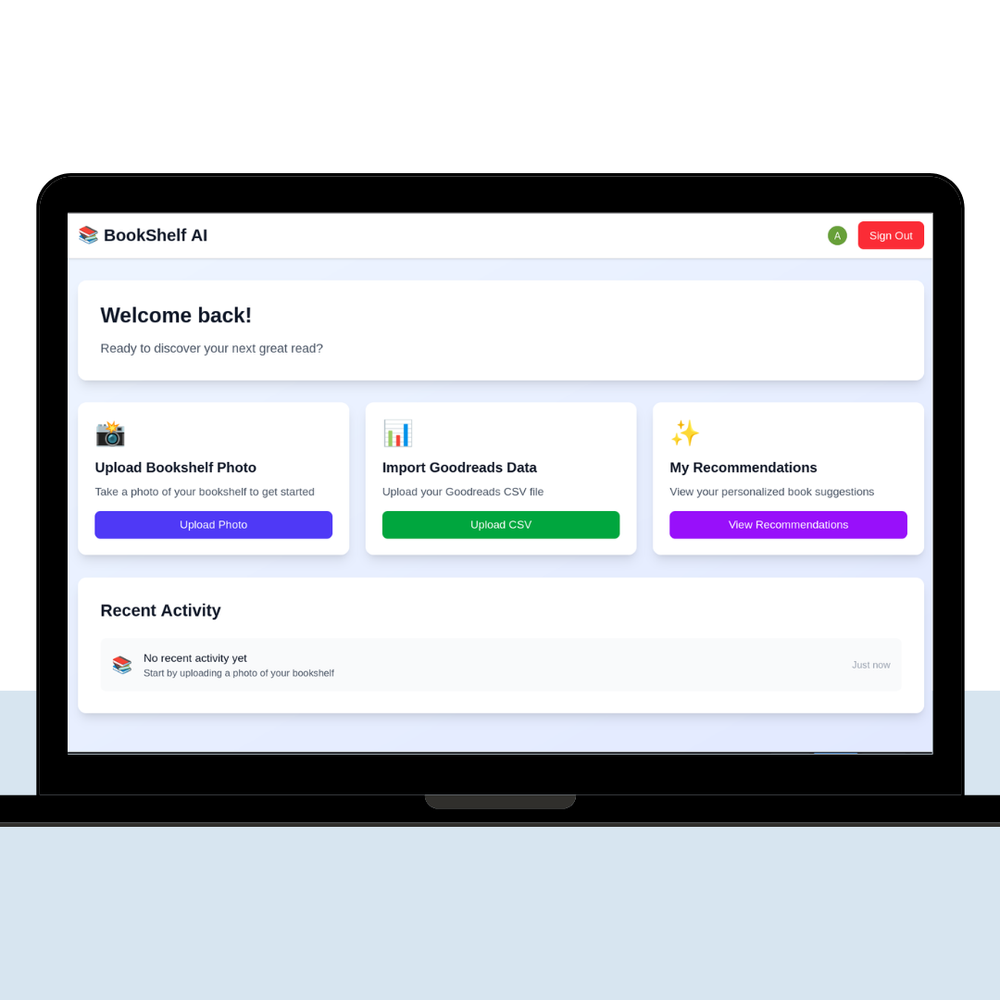

# 📚 BookShelf AI

**Discover your next great read with AI-powered book recommendations**

BookShelf AI transforms your physical bookshelf into personalized reading recommendations. Simply snap a photo of your books, upload your Goodreads data, and get tailored suggestions based on your unique reading preferences.


## 🌟 Features

- **📸 Smart Book Recognition**: Advanced AI identifies books from photos of your bookshelf
- **🎯 Personalized Recommendations**: Get suggestions tailored to your reading taste
- **📊 Goodreads Integration**: Import your reading history for better accuracy
- **⚡ Lightning Fast**: Get recommendations in seconds, not hours
- **🔒 Secure Authentication**: Powered by Clerk for seamless user management

## 🚀 Live Demo

Visit [BookShelf AI](https://your-domain.com) to try it out!

## 📱 How It Works


### 1. Take a Photo
Simply snap a picture of your bookshelf or any book collection. Our AI will identify the books automatically.


### 2. Upload Your Data
Upload your Goodreads CSV file to help us understand your reading history and preferences better.


### 3. Get Recommendations
Receive personalized book recommendations similar to the books you already love and own.


## 🛠️ Tech Stack

- **Frontend**: Next.js 14, React, TypeScript
- **Styling**: Tailwind CSS
- **Authentication**: Clerk
- **AI/ML**: Computer Vision for book recognition
- **Deployment**: Vercel

## 🏃‍♂️ Getting Started

### Prerequisites

- Node.js 18+ 
- npm, yarn, pnpm, or bun
- Clerk account for authentication

### Installation

1. **Clone the repository**
   ```bash
   git clone https://github.com/yourusername/bookshelf-ai.git
   cd bookshelf-ai
   ```

2. **Install dependencies**
   ```bash
   npm install
   # or
   yarn install
   # or
   pnpm install
   # or
   bun install
   ```

3. **Set up environment variables**
   ```bash
   cp .env.example .env.local
   ```
   
   Add your environment variables:
   ```env
   NEXT_PUBLIC_CLERK_PUBLISHABLE_KEY=your_clerk_publishable_key
   CLERK_SECRET_KEY=your_clerk_secret_key
   ```

4. **Run the development server**
   ```bash
   npm run dev
   # or
   yarn dev
   # or
   pnpm dev
   # or
   bun dev
   ```

5. **Open your browser**
   
   Navigate to [http://localhost:3000](http://localhost:3000) to see the application.

## 🔧 Configuration

### Clerk Authentication

1. Create a [Clerk](https://clerk.com) account
2. Create a new application
3. Copy your API keys to `.env.local`
4. Configure sign-in/sign-up URLs in your Clerk dashboard

### Tailwind CSS

This project uses Tailwind CSS for styling. The configuration is in `tailwind.config.js`.

## 🚀 Deployment

### Deploy on Vercel

The easiest way to deploy your Next.js app is to use the [Vercel Platform](https://vercel.com/new?utm_medium=default-template&filter=next.js&utm_source=create-next-app&utm_campaign=create-next-app-readme).

1. Push your code to GitHub
2. Connect your repository to Vercel
3. Add your environment variables in Vercel dashboard
4. Deploy!

### Environment Variables for Production

Make sure to add these environment variables in your deployment platform:

```env
NEXT_PUBLIC_CLERK_PUBLISHABLE_KEY=
CLERK_SECRET_KEY=
DATABASE_URL=
GEMINI_API_KEY=
```
Database url is prisma db url 

## 🤝 Contributing

We welcome contributions! Please see our [Contributing Guidelines](CONTRIBUTING.md) for details.

1. Fork the repository
2. Create your feature branch (`git checkout -b feature/amazing-feature`)
3. Commit your changes (`git commit -m 'Add some amazing feature'`)
4. Push to the branch (`git push origin feature/amazing-feature`)
5. Open a Pull Request
